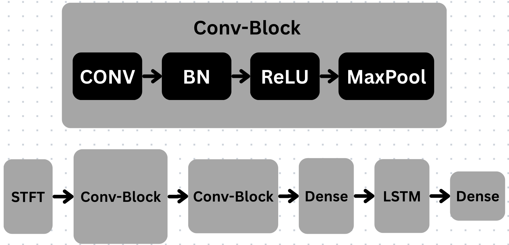

# ECG Time-Series Classification

This repository focuses on classifying Electrocardiogram (ECG) signals into four classes: Normal (Class 0), Atrial Fibrillation (AF) (Class 1), Other (Class 2), and Noisy (Class 3). The project utilizes a deep learning model to address challenges like class imbalance and varying signal lengths in medical datasets.

## Project Overview

The project's core is a neural network designed for ECG time-series classification. It incorporates data preprocessing (resampling, STFT), augmentation, and robust evaluation metrics suitable for imbalanced datasets.

## Model Architecture

The neural network model is built for processing time-series ECG data. 

It features:

* **Short-Time Fourier Transform (STFT)**: Converts 1D ECG signals into a 2D time-frequency representation.
* **Convolutional Blocks (2 layers)**: Capture local patterns using Conv, Batch Normalization, ReLU, and Max Pooling.
* **Dense Layers**: For feature processing and dimensionality adjustment.
* **Long Short-Term Memory (LSTM)**: Learns long-term dependencies in the ECG signals.

## Key Features

* **4-Class Classification**: Normal, AF, Other, Noisy.
* **Hybrid Deep Learning Model**: Combines Convolutional and LSTM layers.
* **Imbalanced Data Handling**: Uses weighted cross-entropy loss and stratified splitting.
* **Signal Preprocessing**: STFT for 2D representation and signal resampling to a fixed length (9000).
* **Data Augmentation**: Applies Gaussian noise and amplitude scaling to improve generalization.
* **Comprehensive Evaluation**: F1-Score, precision, recall, and confusion matrices.
* **Data Reduction Analysis**: Explores performance with PCA-based compression.

## Dataset Insights

The dataset has 6179 ECG samples with a strong class imbalance: ~59% Normal (Class 0), ~28.9% Noisy (Class 2), ~9% AF (Class 1), and ~3.7% Other (Class 3). Signal lengths vary from 2714 to 18286 data points. Class 0 and Class 2 show similar statistical properties, posing classification challenges.

## Preprocessing and Imbalance Handling

* **Resampling**: All signals resampled to 9000 data points (interpolation for shorter, random slicing for longer).
* **Stratified Train-Validation Split**: Ensures consistent class distribution across sets.
* **Weighted Cross-Entropy Loss**: Penalizes minority class misclassifications.
* **Data Augmentation**: Gaussian noise and amplitude scaling applied to ~20% of Class 0 and Class 2 samples.

## Evaluation

The **F1-Score** is the primary evaluation metric due to the imbalanced dataset.

## Hyperparameters

* **Epochs**: 35
* **Batch Size**: 128
* **Learning Rate**: 0.0015 (halved every 15 epochs)
* **STFT**: `n_fft = 256`, `hop_length = 64`
* **Convolutional Layers**: `channels = [32, 64]`, `kernel_size = 6`
* **LSTM Layer**: `input_size = 128`, `hidden_size = 192`, `num_layers = 1`

## Results Summary

* **Neural Network Performance**: Achieved an average F1-Score of 0.74 on the validation set. Class 2 performance was lower due to similarity with Class 0.
* **Random Forest Comparison**: A Random Forest baseline showed significant overfitting (0.99 F1-Score on training, 0.51 on validation), highlighting the neural network's better generalization.
* **Data Augmentation Impact**: Slightly improved validation loss (~0.55 to ~0.53) and average F1-Score (0.74 to 0.76), particularly for Class 0 and Class 2.
* **Data Reduction (PCA-Based Compression)**:
    * **50% Compression**: Similar performance to 50% stratified split.
    * **25% Compression**: Surprisingly, slightly outperformed the 50% stratified and 50% compressed models, indicating sufficient information for learning.
    * **10% Compression**: Performance significantly deteriorated (0.32 F1-Score), indicating excessive information loss.

In conclusion, data compression can be useful for resource-constrained environments, but the augmented model (from task 1.3) remained the top performer.

## How to Run the Code

The project's code is available in the `main.ipynb` Jupyter Notebook.

1.  **Initialize**: Run the first section (Task 1.1) in `main.ipynb` to set up variables.
2.  **Execute**: Proceed sequentially through the other sections of the notebook.
