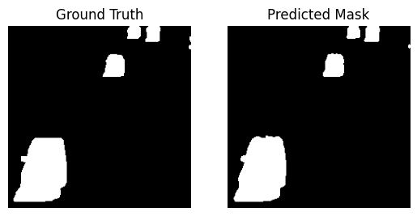

# Scene-Dependent Image Segmentation with U-Net

This project implements a Fully-Convolutional U-Net for scene-dependent image segmentation. 
The goal is to distinguish foreground objects (e.g., moving cars) from the static background 
in a specific video scene. The model is trained and evaluated using the "Highway" dataset 
from the Change Detection 2014 database.



## Key Features
- **Custom U-Net Architecture**: A tailored U-Net model with a symmetrical encoder-decoder path and skip connections for high-fidelity segmentation masks.
- **PyTorch Implementation**: The entire project is built using PyTorch, from the custom dataset to the training loop.
- **Efficient Data Handling**: A custom `ChangeDetectionDataset` class is implemented to efficiently load and preprocess data, including a train/test split.
- **Detailed Evaluation**: The model's performance is rigorously evaluated using key segmentation metrics: Accuracy, Precision, Recall, and Intersection over Union (IoU).

## Model Architecture
The core of this project is a U-Net architecture, a powerful neural network well-suited for pixel-perfect segmentation. Its structure consists of:

- **Encoder Path**: Downsamples the input image through a series of ConvLayer blocks and max-pooling to capture contextual information.
- **Decoder Path**: Upsamples the feature maps, combining them with high-resolution features from the encoder via skip connections to preserve spatial detail.
- **ConvLayer**: A fundamental building block that combines a 2D convolution, batch normalization, and a ReLU activation function.

## Dataset
The model is trained on the "Highway" dataset, which provides pairs of input images (.jpg) and ground-truth masks (.png).

- **Input Images**: RGB images of a highway scene.
- **Ground-Truth Masks**: Grayscale images where dynamic objects are labeled as foreground (white, label 1) and the static background is labeled as background (black, label 0).

The dataset was prepared by excluding the first 470 unlabeled images and splitting the remainder into an 80% training set and a 20% test set.

## Training and Evaluation
The training process was executed on a CUDA-enabled GPU for optimal performance. Key hyperparameters and the final model's performance are summarized below.

- **Loss Function**: CrossEntropyLoss
- **Optimizer**: AdamW
- **Learning Rate Scheduler**: StepLR (reduces learning rate by 90% every 5 epochs)
- **Epochs**: 10
- **Batch Size**: 32

### Final Model Performance
| Metric      | Score |
|-------------|-------|
| Test Loss   | 0.01  |
| Accuracy    | 1.00  |
| Precision   | 0.98  |
| Recall      | 0.97  |
| IoU         | 0.96  |

## Getting Started

### Prerequisites
To run this project, ensure you have the following libraries installed:
```bash
pip install torch torchvision scikit-learn matplotlib Pillow
```

### Usage
The project code is contained within a Jupyter Notebook. Simply open the notebook and execute the cells sequentially to:

1. Load and prepare the dataset.
2. Define and initialize the U-Net model.
3. Run the training and validation loops.
4. View the final evaluation metrics and visualizations.